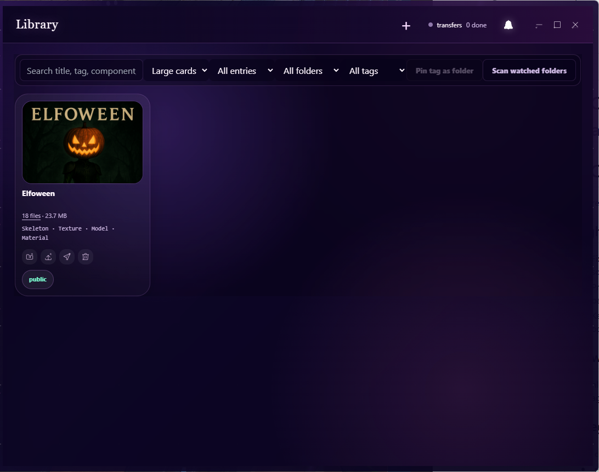
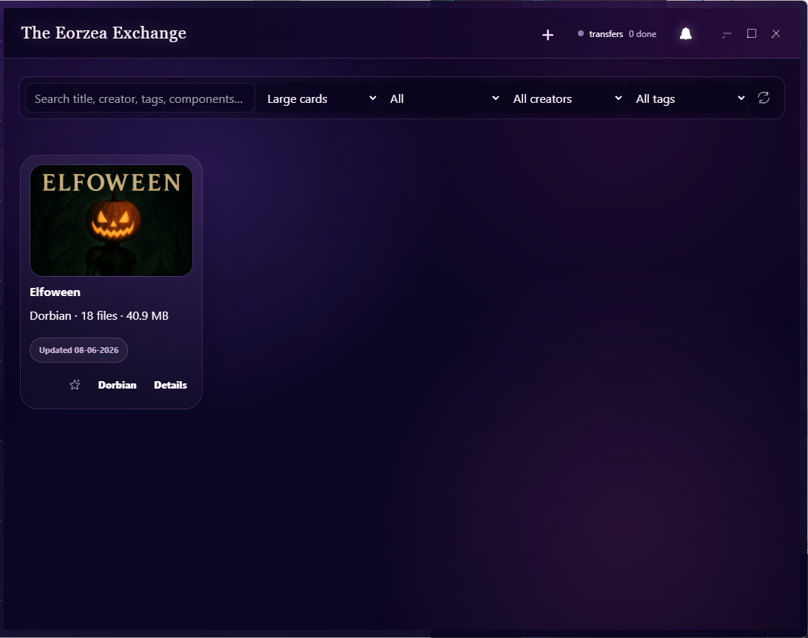
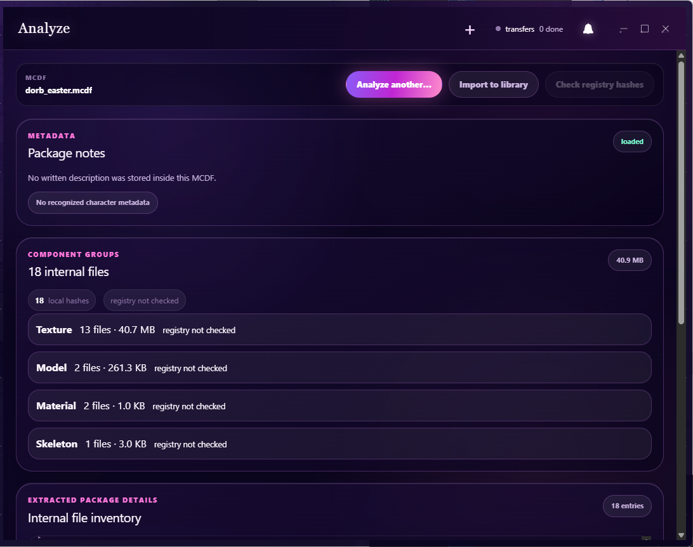
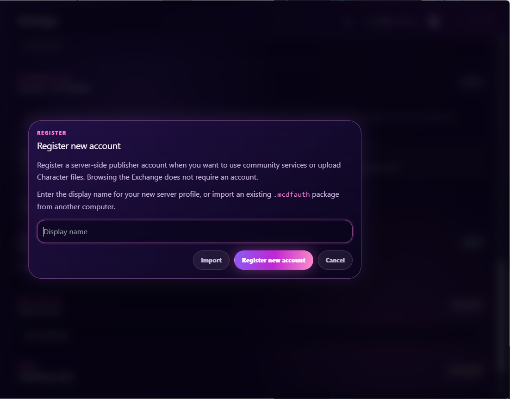

# MCDF Manager

**A fantasy-styled desktop library and Exchange client for Final Fantasy XIV MCDF character packages.**

MCDF Manager turns scattered `.mcdf` files, Google Drive links, share codes, previews, tags, and creator notes into a browsable character collection. Keep your own library tidy, discover looks through **The Eorzea Exchange**, and publish entries with clear ownership, previews, and download options.

<p align="center">
  
  
</p>

> MCDF Manager is a desktop library and sharing client. It is not a game plugin, not a Dalamud plugin, and not a mod loader.

---

## Download

| Platform | Download |
|---|---:|
| Windows x64 | [Download Windows build](https://github.com/TheBigTreeInc/MCDF-Manager/releases/download/client-latest/MCDF-Manager-Windows-x86_64-latest.zip) |
| macOS Apple Silicon | [Download macOS Apple Silicon build](https://github.com/TheBigTreeInc/MCDF-Manager/releases/download/client-latest/MCDF-Manager-macOS-Apple-Silicon-latest.zip) |
| macOS Intel | [Download macOS Intel build](https://github.com/TheBigTreeInc/MCDF-Manager/releases/download/client-latest/MCDF-Manager-macOS-Intel-latest.zip) |
| Linux x64 | [Download Linux build](https://github.com/TheBigTreeInc/MCDF-Manager/releases/download/client-latest/MCDF-Manager-Linux-x86_64-latest.zip) |

---

## Why use MCDF Manager?

Your character collection should feel like a wardrobe, not a folder of mystery files.

MCDF Manager helps you:

- build a visual library of MCDF packages;
- add previews, tags, descriptions, and adult-content labels;
- import from local files, watched folders, direct links, Google Drive links, and Exchange share codes;
- browse public listings in The Eorzea Exchange;
- download MCDFs directly when a source is available;
- sync internet-backed entries into your local library cache;
- export local or synced MCDFs back to disk;
- publish your own Exchange entries with creator ownership;
- edit your published listing title, story, tags, and cover image;
- inspect internal MCDF layers when you need advanced recovery or diagnostics.

---

## The Eorzea Exchange

The Exchange is the public browse view for shared MCDF entries. It focuses on previews, titles, creators, tags, and simple download actions instead of raw archive details.

<p align="center">
  
</p>

You can browse and download public entries without registering. Publishing and owner tools require a registered creator profile.

Exchange entries can include:

- cover image with framing;
- title and description;
- creator name;
- tags and labels;
- adult-content marker;
- source/download information;
- component metadata for rebuildable entries.

When a package is rebuilt from mirrored components, the outer `.mcdf` container does not need to be byte-for-byte identical to the original file. MCDF Manager verifies the internal game payloads so the result can still be correct for use.

---

## Local library

The Library keeps your collection readable and searchable.

<p align="center">
  
</p>

Local library entries can have their own title, description, tags, preview image, and framing. These changes are saved as MCDF Manager metadata and do not modify the original `.mcdf` package.

Library entries support three separate actions:

- **Download MCDF directly** — save a copy from the original internet source when available.
- **Sync source** — cache an internet-backed source locally so it can be inspected and exported later.
- **Export** — save a local or synced MCDF from your library to a chosen folder.

---

## Add MCDFs from anywhere

Add MCDF is split into clear paths: local files on the left, internet imports on the right.

Supported import sources:

- local `.mcdf` files;
- watched folders;
- Google Drive file links;
- direct HTTPS MCDF URLs;
- Exchange share codes;
- bulk share-code paste.

MCDF Manager scans the package, reads layer metadata, calculates hashes, and lets you attach a preview before adding it to your library.

---

## Preview framing

A good listing starts with a good cover.

MCDF Manager includes the same drag and zoom framing flow for Library previews and Exchange cover images. Frame once, save it, and the Library card, Exchange card, and detail view all use the same presentation.

---

## Advanced layer inspection

Most users can stay in Library and Exchange, but advanced users can still inspect what is inside an MCDF.

<p align="center">
  
</p>

The layer view can help with:

- checking which internal files are present;
- identifying textures, models, skeletons, and other payloads;
- exporting individual internal files from local MCDF packages;
- understanding why a package cannot be published;
- validating registry hash checks.

Technical details stay available when needed, but they are not the main browsing experience.

---

## Creator publishing

Registered creators can publish local library entries to The Eorzea Exchange.

<p align="center">
  
</p>

Creator tools allow you to:

- publish entries from your local library;
- edit your own listing metadata;
- replace and frame the cover image;
- delete a listing when you want to retry;
- keep ownership tied to a stable publisher identity.

Package-content changes should be republished from the corrected local entry so downloads stay trustworthy.

---

## Safety and moderation

MCDF Manager treats downloaded and uploaded content as untrusted. It uses BLAKE3 hashes for package and component identity, checks known block/restriction lists during publishing, and keeps moderation state away from normal browsing unless a user needs to know why sharing is blocked.

Users remain responsible for what they upload or publish. The app includes a first-run agreement and explicit publisher registration before community publishing is enabled.

---

## What MCDF Manager is not

MCDF Manager is not:

- a live game editor;
- a Dalamud plugin;
- a mod loader;
- a replacement for your existing FFXIV tools;
- a tool that applies anything directly to the game.

It is a local-first character library and public Exchange client for MCDF packages.

---

## Development

MCDF Manager is built with:

- Tauri;
- React;
- TypeScript;
- Vite;
- Rust.

Requirements:

- Node.js 22+;
- pnpm 9+ through Corepack;
- Rust stable;
- Tauri prerequisites for your operating system.

Run locally:

```powershell
corepack enable
corepack pnpm install
corepack pnpm tauri dev
```

Build the frontend:

```powershell
corepack pnpm run build
```

Build the desktop app:

```powershell
corepack pnpm tauri build
```

---

## Release notes and checksums

Every release should include:

- platform bundles for Windows, macOS, and Linux;
- `checksums.txt`;
- `release-manifest.json`;
- release notes generated from `CHANGELOG.md`.

Official release tags use `client-v<version>`. Main-branch prereleases can be used for testing the newest UI.

---

## Project direction

MCDF Manager follows a simple product rule:

> **Characters first. Archive details second.**

The app should feel like browsing a curated fantasy character collection, while still giving creators and moderators the technical tools they need behind the scenes.
